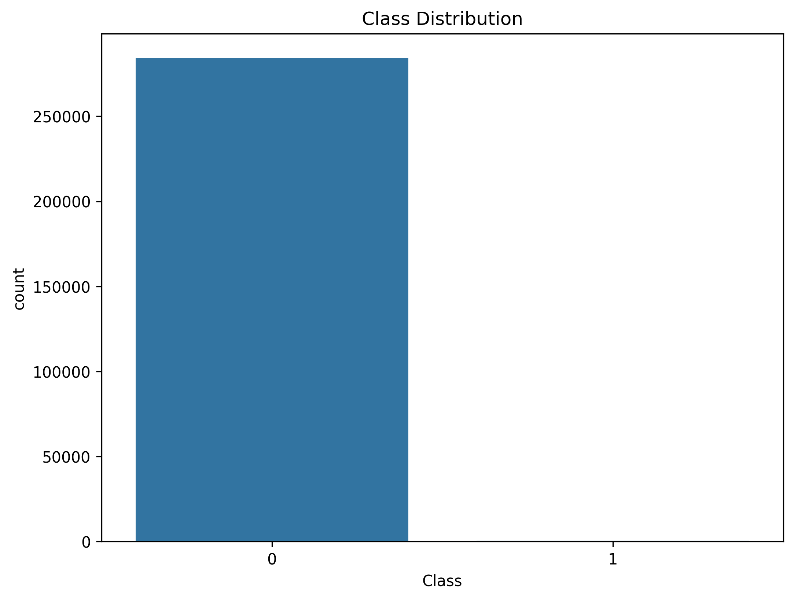
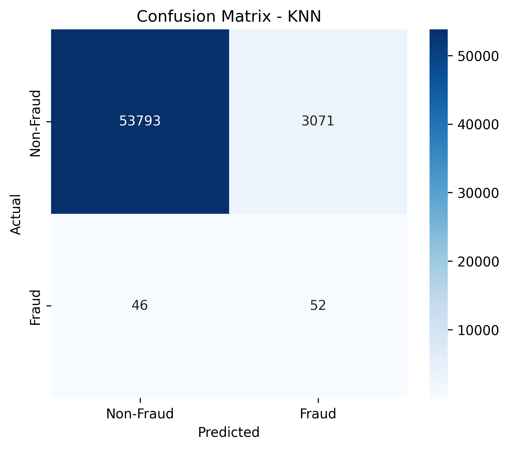
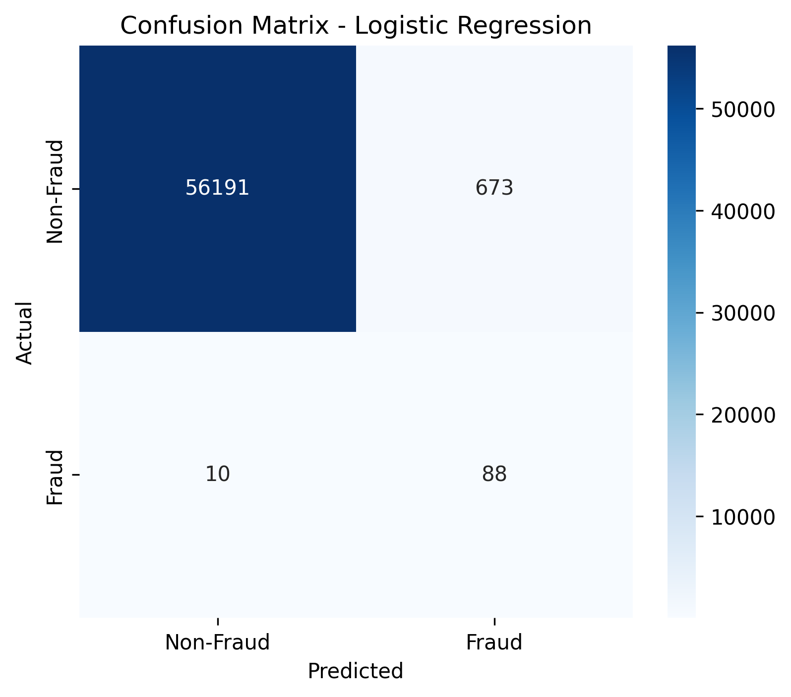
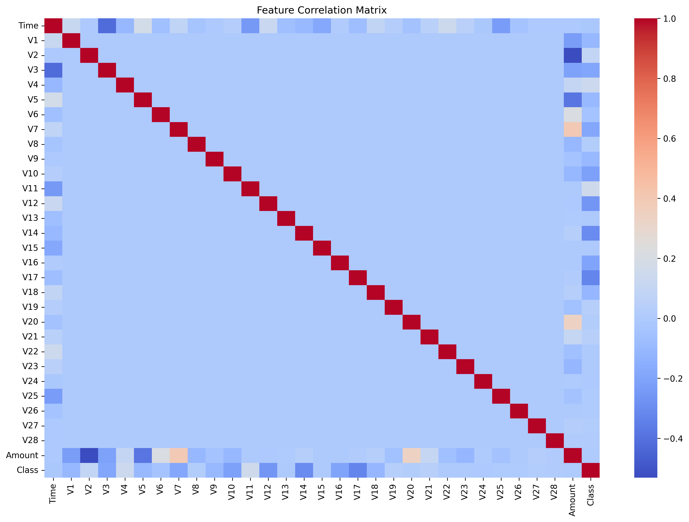
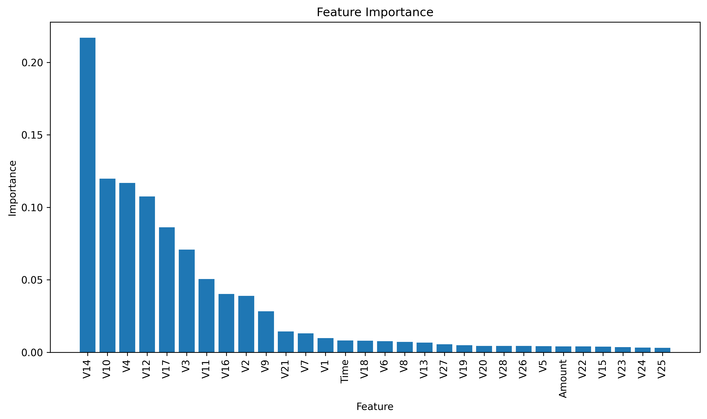
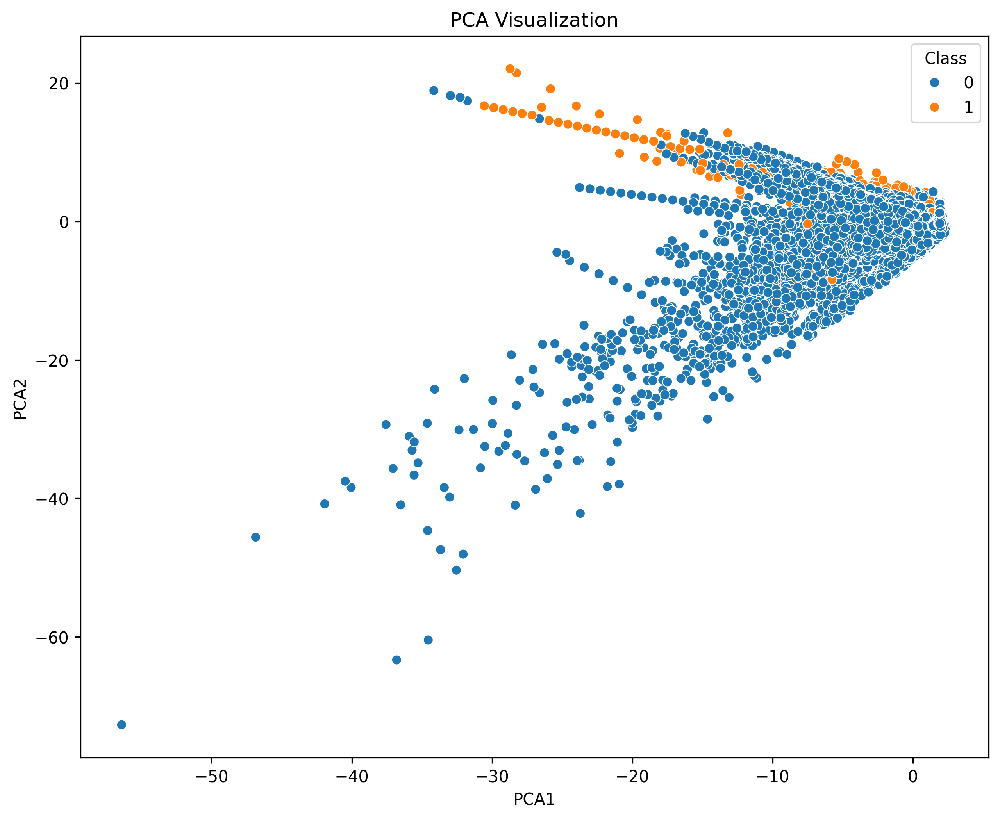

# Credit Card Fraud Detection System

## Project Overview

This project implements a machine learning system for detecting fraudulent credit card transactions. The system utilizes multiple classification algorithms to identify potential fraud cases with high precision and recall, offering a comprehensive approach to financial security.

## Table of Contents

1. [Installation](#installation)
2. [Dataset](#dataset)
3. [Methodology](#methodology)
4. [Model Performance](#model-performance)
5. [Visualizations](#visualizations)
6. [API Usage](#api-usage)
7. [Results Interpretation](#results-interpretation)
8. [Conclusion](#conclusion)

## Installation

```bash
# Clone the repository
git clone https://github.com/brabentil/Model.git
cd credit-card-fraud-detection

# Set up virtual environment
python -m venv .venv
source .venv/bin/activate  # On Windows: .venv\Scripts\activate

# Install dependencies
pip install -r requirements.txt

# Run the application
python main.py
```

## Dataset

The project uses the credit card transaction dataset (`data/creditcard.csv`) with the following characteristics:

- 284,807 transactions with 31 features
- Highly imbalanced: 492 fraudulent transactions (0.17%) vs 284,315 legitimate transactions
- Features include time, amount, and 28 anonymized features (V1-V28) derived from PCA transformation
- No missing values in the dataset

Key statistics:
- Transaction amounts range from $0 to $25,691.16
- Average transaction amount: $88.35
- Class distribution: 284,315 legitimate (Class 0) vs 492 fraudulent (Class 1)

## Methodology

### Data Preprocessing

1. **Exploratory Data Analysis (EDA)**
   - Examined class distribution and feature statistics
   - Verified no missing values

2. **Handling Class Imbalance**
   - Applied Synthetic Minority Over-sampling Technique (SMOTE)
   - Balanced class distribution to 227,451 samples per class

3. **Feature Engineering**
   - Standardized features to improve model performance
   - Split data into training (80%) and testing (20%) sets

### Models Implemented

Four classification algorithms were implemented and compared:

1. **Logistic Regression**
2. **K-Nearest Neighbors (KNN)**
3. **Decision Tree**
4. **Random Forest**

## Model Performance

Summary of model performance metrics:

| Model | Accuracy | Precision (Fraud) | Recall (Fraud) | F1-Score (Fraud) | ROC AUC |
|-------|----------|-------------------|----------------|------------------|---------|
| Logistic Regression | 98.80% | 0.12 | 0.90 | 0.20 | 0.943 |
| KNN | 94.53% | 0.02 | 0.53 | 0.03 | 0.738 |
| Decision Tree | 99.78% | 0.42 | 0.80 | 0.55 | 0.897 |
| **Random Forest** | **99.94%** | **0.83** | **0.83** | **0.83** | **0.913** |


---

## Visualizations

### Class Distribution

  
*Visual representation of the class distribution before and after preprocessing.*

### Confusion Matrices

#### Decision Tree
  
*Confusion matrix for the Decision Tree model showing classification performance.*

#### K-Nearest Neighbors (KNN)
  
*Confusion matrix for the KNN model highlighting classification results.*

#### Logistic Regression
  
*Confusion matrix for the Logistic Regression model.*

#### Random Forest
  
*Confusion matrix for the Random Forest model, displaying prediction performance.*

### Correlation Matrix

  
*Heatmap showing feature correlations within the dataset.*

### Feature Importance

  
*Key features contributing to fraud detection as determined by the model.*

### PCA Visualization

  
*Principal Component Analysis (PCA) representation of the dataset for dimensionality reduction.*

---

```bash
# Start the API server
python main.py

# Example API request
curl -X POST http://localhost:5000/predict \
  -H "Content-Type: application/json" \
  -d '{"features": [0.0, -1.35, -0.07, 2.53, 1.37, -0.33, 0.46, 0.23, ..., 149.62]}'
```

## Results Interpretation

### Analysis of Model Performance

The Random Forest model emerged as the best performing model with:

- **High Accuracy (99.94%)**: Nearly perfect overall classification.
- **Balanced Precision and Recall (both 0.83)**: Critical for fraud detection where both false positives and false negatives carry significant costs.
- **Strong ROC AUC (0.913)**: Indicates excellent discrimination ability between classes.

### Comparing Model Behaviors

- **Logistic Regression**: Despite high recall (0.90) and AUC (0.943), its precision is very poor (0.12), meaning many legitimate transactions would be falsely flagged as fraudulent.
- **KNN**: Underperformed with low precision (0.02) and moderate recall (0.53).
- **Decision Tree**: Good recall (0.80) but moderate precision (0.42).
- **Random Forest**: Provides the best balance of all metrics, making it the optimal choice for deployment.

## Conclusion

This project successfully developed a machine learning system capable of detecting fraudulent credit card transactions with high accuracy and balanced precision-recall metrics. The Random Forest algorithm proved most effective for this task, demonstrating the power of ensemble methods for complex classification problems with imbalanced data.

### Future Enhancements

- Implement real-time transaction scoring
- Explore deep learning approaches (LSTM, Autoencoders)
- Add explainability features for model decisions
- Develop an interactive dashboard for fraud monitoring
- Implement model monitoring for performance drift detection

---

© 2025 Aegis Fraud Detection System
